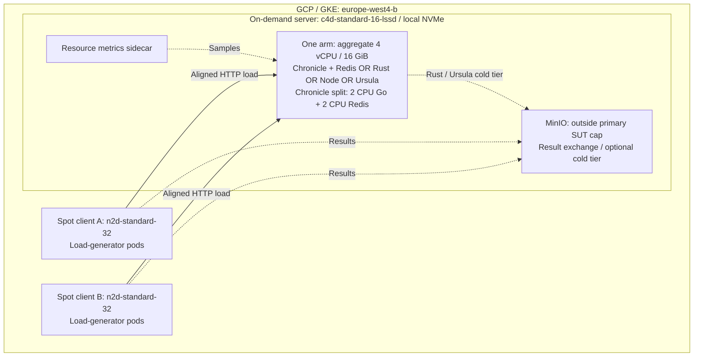
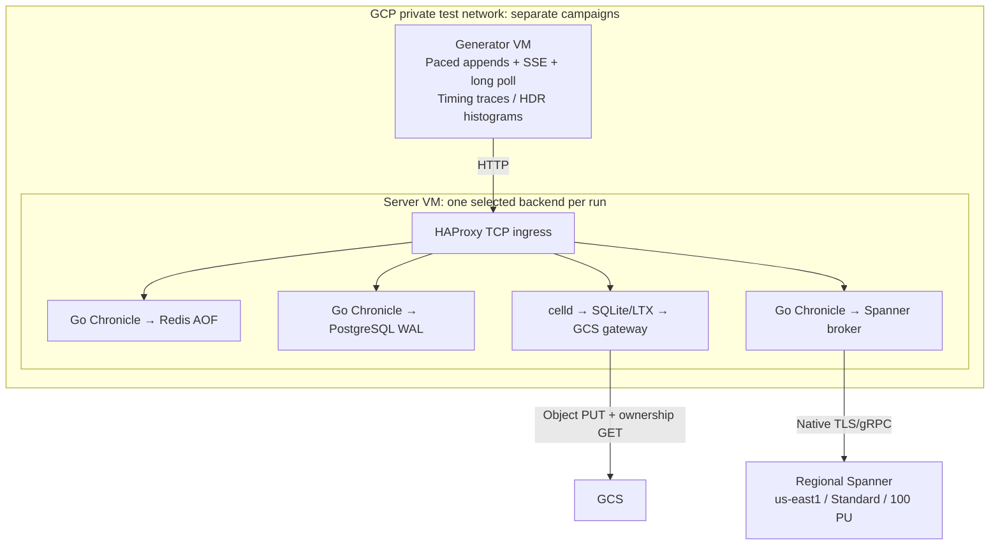
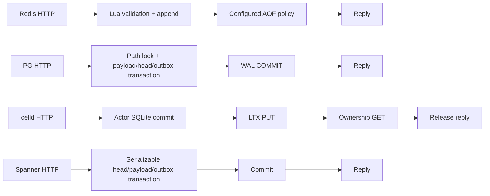
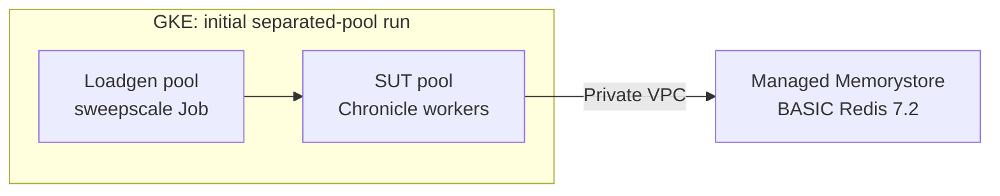

# Redis, PostgreSQL, GCS and Spanner: architecture and results

We evaluated write saturation, fanout, replay, subscription recovery and
low-load latency—not one composite backend score. **We chose Redis for
Chronicle's default because its measured regional write performance and
established implementation fit the current requirements.** It was not the
fastest system across all workloads, and this choice accepts explicit
asynchronous-failover limitations. PG, celld/GCS and Spanner remain experimental
candidates, not additional supported backends on `main`.

**Documentation consolidated: 2026-10-07.** This is a retrospective of earlier
tests, not an October rerun. Retained reports and campaign identifiers below
provide the experiment provenance, independently of Git commit timestamps.

## Test coverage and findings at a glance

The write/fanout/replay campaign ran **24 suites**, followed by corrected replay and
topology/scale-up experiments. Its final combined dataset retains **73 valid
overload observations and zero invalid or missing rows**. The separate PG and
GCS latency cohorts each completed **900 measured appends**. These are distinct
experiments with different durability contracts, not interchangeable scores.
SUT means the system under test; Redis budgets include both Go and Redis.

| Test and load properties | SUT and resource budget | Finding |
| --- | --- | --- |
| **Write saturation:** 256-byte appends; 10k/100k streams; load ladder; 12s warmup + 20s measurement per cell; 3 confirmation runs requested | GKE, **4 vCPU/16 GiB/local NVMe** per arm; Chronicle/Redis, Electric Rust, Node, Ursula | At 100k streams: Redis `always` **34.6k appends/s**, Ursula disk **4.9k/s** (**6.99×**); Rust WAL **≥64.3k/s**, so Redis was not the throughput leader. |
| **Fanout/replay:** 1,000 subscribers at 50 appends/s; SSE up to 2,048 connections; 512 replay readers, exactly 16 MiB/stream | Same equal-budget GKE arms | At 1,000 subscribers Redis `always` delivered **7.4k/50k offered events/s**; Rust WAL and Ursula disk delivered about **50k/s**. At 100-stream replay Redis achieved **56.5 MiB/s with errors**, references about **2,600–2,800 MiB/s** successfully. |
| **Topology screen:** 1/2/4 Go replicas × 1/3 Redis masters; many-key replay and writes | Shared **4 vCPU/16 GiB, one host/disk**, not multi-host HA | Three masters raised 100-stream replay from **58.7 to 106.7 MiB/s** with one Go process. **No topology passed every gate.** |
| **PG/Redis latency:** 2 streams, 10 appends/s, 256-byte JSON; SSE + long-poll readers; 5s warmup + 10s measurement; 3 repeats/mode | Private GCE, Go + local PG WAL or Redis AOF; **no PG synchronous standby** | **900/900** appends; scheduled p50: Redis `everysec` **2.009–2.086 ms**, PG **3.547–3.574 ms**, Redis `always` **4.310–4.813 ms**. PG beat `always`; `everysec` has weaker persistence. |
| **GCS/Redis latency:** same low-load shape, separate cohort; 300 measured samples/mode | Private GCE, **4 CPU/16 GiB SUT**, separate 6 CPU/24 GiB generator; celld/GCS via gateway or Redis | **900/900** appends; service p50: GCS **109.807 ms**, Redis `always` **5.252 ms**, `everysec` **1.749 ms**—**20.9×/62.8× lower**, not throughput ratios. |
| **Subscription recovery:** 10k subscriptions, 1 or 5 links each | GKE Chronicle **1 or 2 CPU** + managed BASIC Redis 7.2 | Sweep p99 **509 ms** (1 link) / **1,019 ms** (5 links). Short samples; latter run had co-location; managed Cluster phase did not run. |
| **Spanner admission:** unchanged 332-test protocol suite, three managed runs | Regional `us-east1`, Standard, **100 processing units** | **324/332, 322/332, 325/332**; property deadlines failed. **No admitted performance benchmark**, not evidence of a throughput ceiling. |

The sections below give topology, methodology, durability boundaries and
provenance. Memory-only modes, AOF `everysec`, WAL commits and object-backed
acknowledgements must not be treated as equivalent persistence guarantees.

## Architectures and tradeoffs

| Backend | Write and read architecture | Principal tradeoff |
| --- | --- | --- |
| **Redis** | Go HTTP server → atomic per-stream, single-slot Lua validation/append/head/producer update. Pub/sub wakes readers; durable reads remain authoritative. Stream hash tags distribute independent streams across Cluster masters. | Short in-memory path and existing operational tooling. Memory cost, hot keys, the subscription control slot and cross-slot fork coordination remain constraints. AOF persistence does not make asynchronous failover lossless. |
| **PostgreSQL** | Same Go storage interface → per-path advisory lock → one transaction for payload, head, producer state and outbox → WAL-flushed COMMIT (`synchronous_commit=on`). Polling drives live reads; forks copy their inherited prefix. | Familiar transactions and a durable outbox. Lock contention, polling, fork-copy/WAL cost and primary/shard capacity need qualification. The measured setup had no synchronous standby. |
| **GCS via celld** | TypeScript stream/subscription/catalog actors → actor-local SQLite → LTX object PUT → ownership-record GET → release response. Generation preconditions and durable output/alarm gates protect ownership and persistence. | Object-backed durability and actor isolation, but remote persistence/ownership gates are on the acknowledgement path. This custom runtime also needs lease, catalog and wake coordination. Not a direct GCS append API. |
| **Spanner** | Go adapter → serializable transactions over stream head, immutable payload/history, producer state and transactional outbox; background subscription/fanout workers. Database time controls expiry. | Managed distributed transactions, but per-stream ordering still serializes a hot head. Transaction RPCs, retries and background contention can consume latency budget. Tested regional Standard/100-PU deployment, not the proposed multi-region design. |

## GCP test rigs: three different experiments

These topologies answer different questions. **The saturation-test Redis process was
not managed Memorystore; the GCS backend experiment was not the comparison rig's MinIO
cold tier; none of these measurements is the later experimental Rust/Raft
cluster's performance.**

### 1. GKE: equal-budget write, fanout and replay comparisons

The primary comparison and fixed-budget topology screen used GKE in
`europe-west4-b`, with one on-demand `c4d-standard-16-lssd` server machine and
two separate Spot `n2d-standard-32` client machines. The physical server had
16 vCPUs, but the **combined application budget was 4 vCPUs and 16 GiB**.
Chronicle and Redis shared that budget; Redis AOF used local NVMe.

The client machines did not compete with the server for CPU. Kubernetes client
pods partitioned the stream domain and increased offered concurrency through a
fixed ladder. MinIO exchanged results and could serve Rust/Ursula cold-tier
traffic; its exclusion from the primary cap is a disclosed fairness limit.
The topology screen varied 1/2/4 Chronicle replicas and 1/3 Redis masters **on
the same server and disk**, dividing the existing budget rather than adding it.
Separate 8-/16-vCPU scale-up runs used larger budgets; their results are not
equal-compute comparisons with the 4-vCPU reference systems.

### 2. Private GCE: PG/Redis/GCS latency and Spanner qualification

The later low-load experiments used separate private generator and server VMs,
not the GKE saturation rig. The GCS baseline and transport follow-up capped the
SUT at 4 CPU/16 GiB and the generator workload at 6 CPU/24 GiB. Spanner was a
regional `us-east1` Standard instance at 100 processing units. PG used local
durable WAL on the server, not managed Cloud SQL or a synchronous replica.

This is a schematic of separate campaigns, **not four simultaneous backends**.
The Spanner broker preserved native TLS/gRPC rather than terminating Spanner
TLS. GCS gateway receipts bounded/disclosed object requests and transfer; fresh
TLS connections added overhead in the baseline. Infrastructure deadlines,
exact resource identities, archive hashes and final deletion readbacks were
retained. Billing models were not invoices, and soft-delete retention was not
immediate physical erasure.

The acknowledgement boundaries differ:

Readiness required readers to attach before pacing. Retained artifacts include
the exact scenario and binaries, intended/actual request timing, raw completion
traces, HDR histograms, clock/readiness evidence and resource captures. PG's
final cohort used hierarchical cgroup accounting, including dynamic database
children; cgroup `memory.current` is not process RSS. The earlier GCS report
used process CPU/RSS measurements. Neither provides a continuous memory peak.
Counts of reader arrivals alone do not prove which records arrived.

### 3. GKE + Memorystore: subscription recovery, not competitor ranking

The [initial subscription run](../../loadtest/RESULTS-gke.md) used separate
`e2-standard-2` pools, 1 CPU/1 GiB for Chronicle and 1 GiB BASIC Redis. At 10,000
subscriptions with one link each, sweep p99 was **509 ms**, below the 1.5-second
gate (20-second warmup, 40-second measurement, only 20 sampled ticks).
This was not a competing-server test. The later
[gate-2 run](../../loadtest/RESULTS-gate2.md) measured **1,019 ms** with five
links per subscription and 2 CPUs; quota shortages caused workload co-location,
and the intended managed Redis Cluster phase was skipped. These results cannot
be presented as a completed managed-Cluster capacity or HA comparison.

## Benchmark methodology: write saturation, fanout and replay

We ran the official client/result formats through the repository's
[adapter and runbook](../../benchmarks/ds-bench/README.md), pinned to
[`93a1a066a511`](https://github.com/electric-sql/ds-bench/tree/93a1a066a511ad2ce5114dc429afb1fd0f6d99bf).
We added Chronicle deployment/reset/metrics integration, rather than inventing
a faster client path for Redis. Comparison images covered Electric Rust 0.1.5
(WAL/memory), Node (memory), Ursula 0.2.0 (disk/memory), and Redis AOF
`always`/`everysec`; S2 was outside this campaign.

The [frozen campaign](../../benchmarks/ds-bench/campaign.json) contained 24
sequential suites. Our adaptations and validity rules were:

- **Equal primary SUT budget:** a calibration compared Go:Redis CPU splits
  1:3, 2:2 and 3:1; the selected 2:2 split stayed fixed. Both processes and
  whole-pod working set counted, not just the small Go process.
- **Aligned fleet windows:** use the pinned start barrier and window checks.
  We did not reuse the upstream June headline numbers, which predate these
  protections and can overcount aggregate throughput.
- **Saturation, not one burst:** 256-byte writes, 10k/100k streams, 12-second
  warmup and 20-second measurement per write cell, an offered-load ladder,
  two consecutive low-gain rungs (8% threshold) and three confirmation runs
  requested. A ladder that ends early is a lower bound, not a ceiling.
  Reported write latency follows the upstream sub-saturation rule: the largest
  rung at or below 80% of peak, rather than queueing latency at peak load.
- **Exact replay setup:** seed 16 MiB per stream in 4 KiB records; retry failed
  seed appends and probe every stream before measurement. The corrected rule
  applied to every implementation. Corrected supplements replaced complete
  system/workload slices, not hand-picked individual cells.
- **Different workload families:** one-stream fanout at 50 appends/s and up to
  1,000 subscribers; multi-stream SSE up to 2,048 connections; catch-up at 512
  readers; mixed writes/replay; SSE delivery under write load. Read/mixed cells
  followed upstream single-run methodology, not the write confirmation count.
- **No discarded overloads:** preserve incomplete work/errors as overload.
  The final comparison contains 73 valid overload observations and no invalid
  or missing result rows. Preserve raw per-pod JSON/HDR, merged results, resource
  samples, resolved suites, source/diff/image hashes and teardown evidence.

### Selected write-path comparisons and diagnostic improvements

| Experiment | Chronicle/Redis | Opponent or earlier configuration | Supported conclusion |
| --- | --- | --- | --- |
| GKE writes, 100k streams, AOF `always` vs disk WAL | **34.6k appends/s**, reported p99 **14.4 ms**, peak working set **598 MiB** | Ursula disk **4.9k/s**, p99 **186.6 ms**, about **1.9 GiB** | **6.99× throughput** from unrounded results, much lower reported tail and memory. Latencies come from each system's selected load rung, not identical offered load. |
| GKE writes, 100k streams, AOF `everysec` | **38.5k appends/s**, p99 **9.8 ms** | Ursula disk **4.9k/s** | About **7.9× throughput**, but explicitly weaker acknowledgement durability. |
| GCE low-load median, AOF `always` | **5.252 ms** | Custom celld/GCS **109.807 ms** | **20.9× lower median** in this deployed path; not a throughput result. |
| GCE low-load median, AOF `everysec` | **1.749 ms** | Custom celld/GCS **109.807 ms** | **62.8× lower median**, with the weaker persistence setting disclosed. |
| Chronicle SSE diagnostic, same system before/after | **29.8k events/s** | Earlier Chronicle path **11.4k events/s** | About **2.6× improvement** from the persistent-wait path; still overloaded at 50k offered deliveries/s, not a competitor-wide win. |

The [full cross-system report](ds-bench/results/20260727T122510Z-bd85274b/report.md)
also records workloads where other implementations led: at 100k streams,
Rust WAL reached **at least 64.3k appends/s** (ladder exhausted), Node memory
**50.9k/s**, and Rust memory **413.6k/s**. Memory modes are not durability peers.
For 100-stream/512-reader catch-up, Chronicle AOF `always` reached **56.5 MiB/s
with errors**, versus roughly **2,600–2,800 MiB/s** for the
successful reference rows. Rust and Ursula also won
important high-fanout cells. Redis's write advantage over Ursula disk did not
carry over to those read paths.

The [topology screen](ds-bench/configuration-comparison.md) then varied
Chronicle replicas and Redis masters within the fixed budget. Three masters
helped many-key replay (106.7 MiB/s for one Chronicle/three masters versus
58.7 MiB/s for one/one), but one hot stream still stayed on one master.
No topology met every comparison gate; more CPU in a single pair did not
generally raise throughput. These are historical implementation measurements,
not a benchmark of every subsequent SSE/catch-up optimization on `main`.

## Completed benchmarks: compare within each cohort

Both cloud cohorts offered **10 appends/s**, two streams, configured 256-byte
JSON messages, batch 1, no producer deduplication, one SSE and one long-poll reader
per stream, 5-second warmup and 10-second measurement, three repeats per mode.
These are low-load latency tests, **not saturation or Redis Cluster capacity
comparisons**. Do not combine their quantiles or durability guarantees.

### PostgreSQL: measured latency, conformance and recovery

The final PostgreSQL/Redis cohort (`9b6e`) tested **Go Chronicle backed by a
single PostgreSQL primary**, with per-path transaction locking, payload/head/
producer/outbox updates and **`synchronous_commit=on`**. PostgreSQL flushed
local WAL before acknowledging; no synchronous standby was present in this
cloud comparison. A separate private VM generated the load through HAProxy.

**PostgreSQL workload:** two streams, **10 total appends/s**, 256-byte JSON,
batch 1, no producer deduplication, one SSE and one long-poll reader per stream.
Each of three repeats had a 5-second warmup and 10-second measurement:
**100 measured appends/repeat, 300 PostgreSQL appends in total**.

Scheduled latency includes delay from the intended send time. Values below are
ranges of per-repeat quantiles, not pooled percentiles or confidence intervals.

| Backend | Scheduled p50, ms | Scheduled p99, ms |
| --- | ---: | ---: |
| Redis AOF `everysec` | 2.009–2.086 | 2.886–3.108 |
| PostgreSQL | 3.547–3.574 | 4.266–4.456 |
| Redis AOF `always` | 4.310–4.813 | 5.954–6.927 |

**Finding:** PostgreSQL had lower p50 and p99 than Redis AOF `always` in every
reported repeat range; Redis `everysec` was faster but uses a weaker persistence
policy. These results support PG as a competitive low-load backend, not a
claim about its saturation throughput or synchronous-replica latency.

| PostgreSQL check | Retained result | Scope |
| --- | --- | --- |
| Measured appends | **300/300 successful**, zero reported errors or drain successes | Three low-load repeats, not a capacity ceiling |
| Protocol conformance | **332/332 assertions passed** | Tested adapter and pinned suite |
| Process-crash recovery | **48-byte recovery probe passed** | Process restart with storage retained, not disk/AZ loss |
| Separate local synchronous-standby promotion | Acknowledged/ambiguous writes retained; new writes blocked until replacement standby joined | Local test, not the cloud latency topology or cloud HA qualification |

All nine cells were valid: **900/900 measured appends**, zero reported errors or
drain successes, and 900 arrivals for each reader type. Each mode passed 332/332
conformance assertions and its 48-byte process-crash recovery probe. Arrival
counts are not record-identity proof; process recovery is not disk/AZ-loss proof.
Later proposed cloud capacity phases did **not** run. A separate local PG
synchronous-standby promotion test retained acknowledged/ambiguous writes and
blocked new writes until a replacement standby joined; it was not a cloud HA test.

### GCS: low-load latency and transport follow-up

**Redis/GCS baseline (2026-09-11): pooled service latency**, from actual request
start to completion, 300 successful measured samples per mode:

| Backend | Service p50, ms | Service p99, ms |
| --- | ---: | ---: |
| Redis AOF `everysec` | 1.749 | 7.615 |
| Redis AOF `always` | 5.252 | 7.660 |
| Custom celld/GCS | 109.807 | 133.533 |

All 900 measured appends succeeded. This GCS path included a budget gateway
using fresh TLS connections, not an unmediated storage baseline. A subsequent
connection-pooling experiment lowered median latency from 109.122 to 92.249 ms
but worsened p99 from 153.548 to 3,178.066 ms. One fresh-arm cell failed delivery
validation; those numbers describe append components only, not a clean paired
qualification. Small samples and sequential execution preclude a general verdict
on connection pooling.

### Spanner: qualification did not admit performance testing

**Spanner: no admitted benchmark.** Three managed qualification runs returned
**324/332, 322/332 and 325/332**, failing unchanged five-second property deadlines.
Local emulator passes do not supersede those failures. A diagnostic showed that
30 serial PUT/POST/GET cases can exhaust the deadline: 90 requests passed locally
in 675 ms; adding 60 ms/request caused a timeout at 5,003 ms. This demonstrates a
timeout mechanism, **not the cause of managed latency or a Spanner throughput
ceiling**. Lock contention remains a hypothesis, not an established diagnosis.

## Decision: retain Redis for the current requirements

1. **Measured latency advantage over the tested GCS path:** about 21× lower
   median with AOF `always`, 63× with `everysec`. Avoiding per-acknowledgement
   object PUT/ownership GET is a plausible architectural explanation, not a
   measured causal decomposition.
2. **PG remains competitive:** `everysec` had the lowest latency, but
   **PostgreSQL beat Redis `always`**. Performance alone does not justify
   rejecting PG; persistence requirements and integration cost matter.
3. **Less new engineering for Chronicle:** existing Lua state transitions,
   notification hints, conformance, deployment and operational support. Spanner
   has not cleared the managed admission gate; the alternatives add distinct
   transaction, actor or coordination machinery.
4. **Existing, separate scaling evidence:** the
   [configuration campaign](ds-bench/configuration-comparison.md) reached
   33.8k writes/s with one Chronicle process and three Redis masters sharing
   4 vCPUs/16 GiB on one host. That is software-sharding evidence, not HA or a
   matched PG/GCS/Spanner result. The same report documents fanout/replay limits
   and stronger results from other stream implementations.

**This is a workload and implementation decision, not a universal backend
ranking.** Async Redis replica promotion can lose acknowledged writes; one hot
stream remains single-slot. If lossless failover or sustained high-fanout/replay
dominates the requirements, these results do not establish Redis as the choice.
Use [deployment requirements](../DEPLOYMENT.md) and the
[testing guarantees](../TESTING.md), not these latency tables, to choose the
failure contract. PostgreSQL remains credible when transactional integration
matters; GCS when object-backed retention matters; Spanner when managed
cross-key/distributed transactions justify further qualification.

## Evidence provenance

This summary transcribes retained experiment reports, not a new benchmark.
Raw archives are private and are not published here; hashes identify the exact
evidence without exposing cloud resource metadata. Invalid attempts are excluded,
not repaired by combining cohorts.

The linked public [benchmark result directories](ds-bench/results/README.md)
contain metadata extracts, not the complete raw corpus. They preserve the
reported numbers and provenance, but the original archive seals cannot be
independently recomputed from those extracts alone.

| Evidence | SHA-256 |
| --- | --- |
| PG/Redis final full archive, 41,868,519 bytes | `b518d884745c3f60b1f788b426ded24acadf0ee2acb4a78b74d6cb3bf30227cc` |
| GCS baseline report (`cloud-baseline-report.md`) | `ad0acfe8a3054d39f6e64bfe5e9a6da12e2c9f749b38e6c7d2910e3eea32070f` |
| GCS transport follow-up (`gateway-paired-report.md`) | `b343b4c100cedd330d2be1b7a9ad2382b053e8bf959af9e8b444af49d75c17da` |
| Spanner third managed run archive | `422934a5505fb2b3c30f8ad49e0202bce18ce107c92182cc06f00719e5f7ac09` |

The celld acknowledgement sequence is also source-inspectable in its pinned
[actor implementation](https://github.com/denoland/celld/blob/10cb1303dac710dcb3b557e318e08c855261f68b/crates/celld/actor.rs#L3760-L3867).
